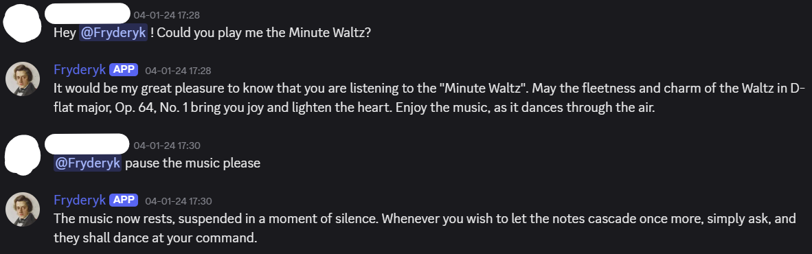
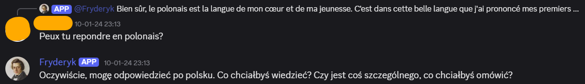

# FryderykGPT

## 🎹 A Discord Bot That Channels Fryderyk Chopin (and Used to Play Music)

FryderykGPT is a characterful Discord bot that impersonates the composer Fryderyk Chopin, powered by the OpenAI Assistant API. It once delighted users by responding in elegant prose **and** playing music directly in voice channels—until recent limitations made the latter no longer feasible.

---

## 📦 Archived Notice

> 🛑 **Music playback is no longer supported.**  
Due to the deprecation of major music libraries (e.g. `ytdl-core`), this project has been archived. The code remains public for reference and educational purposes.

---

## ✨ Features (when active)

- 🎵 Played music from YouTube in Discord voice channels using `ytdl-core`.
- 🧠 Conversational assistant using OpenAI’s Assistant API.
- 🎼 Responded in-character as Fryderyk Chopin.
- 🗣️ Accepted natural language commands like:
  - “Fryderyk, please play Chopin Nocturnes.”
  - “What are your thoughts on Beethoven?”

---

| Fryderyk in Action |
|--------------------|
|  |
|  |
|  |
|  |

---

## 🔧 Requirements

- Node.js (v18+ recommended)
- FFmpeg (added to your system PATH)
- OpenAI API Key & Assistant Token
- Discord Bot Token

---

## 🗂️ Project Status

FryderykGPT has been **archived** but left intact to demonstrate:
- Integration with OpenAI’s Assistant API.
- Voice connection handling using `@discordjs/voice`.
- Music streaming setup with `ytdl-core`.

You are welcome to explore or fork the code to build on its ideas.

---

## 👋 Final Words from Fryderyk

> *“Alas, though I can no longer perform for you in sound, my spirit remains to converse, reflect, and reminisce. Let us speak, if not sing.”*
